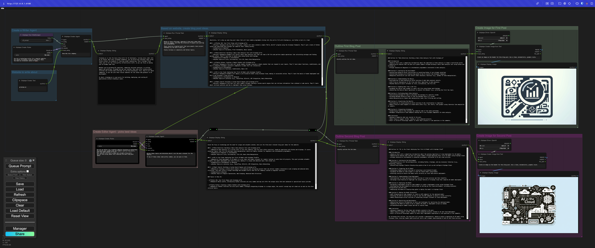

# ComfyUI Griptape Nodes

This repo creates a series of nodes that enable you to utilize the [Griptape Python Framework](https://github.com/griptape-ai/griptape/) with [ComfyUI](https://github.com/comfyanonymous/ComfyUI), integrating LLMs (Large Language Models) and AI into your workflow.

This example creates two [Griptape Agents](https://docs.griptape.ai/stable/griptape-framework/structures/agents/) - a Writer and an Editor. The writer has a [WebScraper](https://docs.griptape.ai/stable/griptape-tools/official-tools/web-scraper/) tool and gets a description of a website. It then generates blog topic ideas and passes them to_ the Editor Agent. The editor chooses the top 3 topics, and generates outlines and next actions for the next two. A third Agent generates thumbnail images for each blog post using a [Prompt Image Generation Task](https://docs.griptape.ai/stable/griptape-framework/structures/tasks/#prompt-image-generation-task) based on the outlines.



The repo currently has a subset of Griptape nodes, with more to come soon. Current nodes can:

* Create [Agents](https://docs.griptape.ai/stable/griptape-framework/structures/agents/) using these models:
    * OpenAI
    * Amazon Bedrock 
    * Google Gemini
    * Anthropic Claude

* Control agent behavior with access to [Rules and Rulesets][https://docs.griptape.ai/stable/griptape-framework/structures/rulesets/]
* Give Agents access to [Tools](https://docs.griptape.ai/stable/griptape-tools/):
    * [Calculator](https://docs.griptape.ai/stable/griptape-tools/official-tools/calculator/)
    * [DateTime](https://docs.griptape.ai/stable/griptape-tools/official-tools/date-time/)
    * [WebScraper](https://docs.griptape.ai/stable/griptape-tools/official-tools/web-scraper)
    * [FileManager](https://docs.griptape.ai/stable/griptape-tools/official-tools/file-manager)
    * [AudioTranscriptionClient](https://docs.griptape.ai/stable/griptape-tools/official-tools/audio-transcription-client/)
    * [GriptapeCloudKnowledgeBaseClient](https://docs.griptape.ai/stable/reference/griptape/tools/#griptape.tools.GriptapeCloudKnowledgeBaseClient)

* Run specific Agent Tasks:
    * [PromptTask](https://docs.griptape.ai/stable/griptape-framework/structures/tasks/#prompt-task)
    * [TextSummaryTask](https://docs.griptape.ai/stable/griptape-framework/structures/tasks/#text-summary-task)
    * [ToolTask](https://docs.griptape.ai/stable/griptape-framework/structures/tasks/#tool-task)
    * [ToolkitTask](https://docs.griptape.ai/stable/griptape-framework/structures/tasks/#toolkit-task)
    * [PromptImageGenerationTask](https://docs.griptape.ai/stable/griptape-framework/structures/tasks/#prompt-image-generation-task)
    * [ImageQueryTask](https://docs.griptape.ai/stable/griptape-framework/structures/tasks/#image-query-task)
    * [VariationImageGenerationTask](https://docs.griptape.ai/stable/griptape-framework/structures/tasks/#variation-image-generation-task) (In Beta)

* [Generate Images](https://docs.griptape.ai/stable/griptape-framework/structures/tasks/#image-generation-tasks) using these models:
    * OpenAI
    * Amazon Bedrock Stable Diffusion
    * Amazon Bedrock Titan
    * Leonardo.AI

 
## Example

In this example, we're using three `Image Description` nodes to describe the given images. Those descriptions are then `Merged` into a single string which is used as inspiration for creating a new image using the `Create Image from Text` node, driven by an `OpenAI Driver`.


## Using the nodes - Video Tutorials
1. Part 1: Installation: https://youtu.be/L4-HnKH4BSI?si=Q7IqP-KnWug7JJ5s
2. Part 2: Griptape Agents: https://youtu.be/wpQCciNel_A?si=WF_EogiZRGy0cQIm 
3. Part 3: Controlling which LLM your Agents use: https://youtu.be/JlPuyH5Ot5I?si=KMPjwN3wn4L4rUyg

## Installation


#### 1. ComfyUI

Install [ComfyUI](https://github.com/comfyanonymous/ComfyUI) using the [instructions](https://github.com/comfyanonymous/ComfyUI?tab=readme-ov-file#installing) for your particular operating system.

#### 2. Add API Keys to your environment

Certain API keys are required for various nodes to work. It's recommended to add these to a `.env` file in your base comfyUI folder before you start ComfyUI. 

_Note: Most nodes will work fine with just the `OPENAI_API_KEY`, so at least make sure you have that one._

```bash
OPENAI_API_KEY=
GOOGLE_API_KEY=
GOOGLE_API_SEARCH_ID=
AWS_ACCESS_KEY_ID=
AWS_SECRET_ACCESS_KEY=
AWS_DEFAULT_REGION=
LEONARDO_API_KEY=
ANTHROPIC_API_KEY=
VOYAGE_API_KEY=
GRIPTAPE_API_KEY=
```

You can get the appropriate API keys from these respective sites:

* OPENAI_API_KEY: https://platform.openai.com/api-keys
* GOOGLE_API_KEY: https://makersuite.google.com/app/apikey
* AWS_ACCESS_KEY_ID & SECURITY_ACCESS_KEY:
    * Open the [AWS Console](https://console.aws.amazon.com/)
    * Click on your username near the top right and select **Security Credentials**
    * Click on **Users** in the sidebar
    * Click on your username
    * Click on the **Security Credentials** tab
    * Click **Create Access Key**
    * Click **Show User Security Credentials**
* LEONARDO_API_KEY: https://docs.leonardo.ai/docs/create-your-api-key
* ANTHROPIC_API_KEY: https://console.anthropic.com/settings/keys
* VOYAGE_API_KEY: https://dash.voyageai.com/

#### 3. Install Griptape-ComfyUI

There are two methods for installing the Griptape-ComfyUI repository. You can either download or git clone this repository inside the `ComfyUI/custom_nodes`, or use the [ComfyUI Manager](https://github.com/ltdrdata/ComfyUI-Manager).

* Option A - **ComfyUI Manager** _(Recommended)_

    1. Install ComfyUI Manager by following the [installation instructions](https://github.com/ltdrdata/ComfyUI-Manager#installation).
    2. Click **Manager** in ComfyUI to bring up the ComfyUI Manager
    3. Search for "Griptape"
    4. Find the ComfyUI-Griptape repo.
    5. Click **INSTALL**
    6. Follow the rest of the instructions.

* Option B - **Git Clone**

    1. Open a terminal and input the following commands:

        ```
        cd /path/to/comfyUI
        cd custom_nodes
        git clone https://github.com/griptape-ai/ComfyUI-Griptape
        ```


#### 4. Make sure libraries are loaded

Libraries should be installed automatically, but if you're having trouble, hopefully this can help.

There are certain libraries required for Griptape nodes that are called out in the requirements.txt file.

```bash
griptape[all]
python-dotenv
duckduckgo_search
```

These should get installed automatically if you used the ComfyUI Manager installation method. However, if you're running into issues, please install them yourself either using `pip` or `poetry`, depending on your installation method.

* Option A - **pip**

    ```bash
    pip install "griptape[all]" python-dotenv duckduckgo_search
    ```

* Option B - **poetry**

    ```bash
    poetry add "griptape[all]" python-dotenv duckduckgo_search
    ```

#### 5. Restart ComfyUI

Now if you restart comfyUI, you should see the Griptape menu when you click with the Right Mouse button. 

If you don't see the menu, please come to our [Discord](https://discord.gg/fexDeKxf) and let us know what kind of errors you're getting - we would like to resolve them as soon as possible!


---

## Troubleshooting

#### API Keys

When you run ComfyUI with the Griptape nodes installed, the installation method will check your environment variables and automatically install the appropriate API keys in a file called: `griptape_config.json`.

If for some reason your environment variables aren't being set properly, you can do this manually by simply copying over the `griptape_config.json.default` file to `griptape_config.json` and add the proper keys there.

If you ever need to change your API keys, go ahead and update that configuration file with the proper key.
